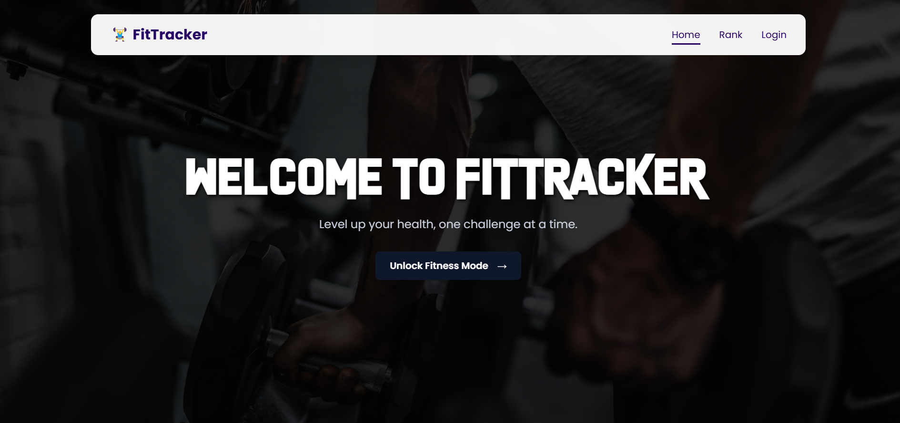
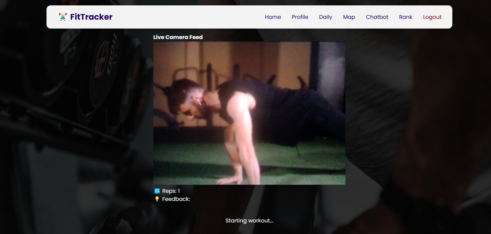

# 🏋️‍♂️ AI-Based Fitness Game with Real-Time Pose Detection

An interactive web app that turns home workouts into a fun and gamified experience.  
It uses your **webcam** to detect your body movements in real time and provides **XP-based progression**, motivational **audio feedback**, and **calorie tracking**.

---

## 🚀 Key Features

- 🎯 Real-time pose estimation (squats, pushups, planks)
- 🧠 AI feedback on posture using TensorFlow.js
- 🔊 Text-to-speech audio cues for motivation and correction
- 🧬 XP level system and global leaderboard
- 🔥 Calorie estimation using MET values and time
- 📈 User stats tracking (via MongoDB backend)

---

## 🛠️ Tech Stack

- **Frontend:** React.js, TensorFlow.js, Netlify
- **Backend:** Flask, MongoDB, OpenCV, Render
- **Tools:** WebCam, Text-to-Speech, REST API, GitHub

---

## 🌐 Live Demo

👉 [Click here to try the app](https://your-netlify-link.netlify.app)

---

## 🖼️ Screenshots

| Dashboard | Pose Detection |
|-----------|----------------|
|  |  |

> 💡 Place your screenshot images inside a folder named `screenshots/` in the root of your project.

---

## 🧪 How It Works

1. **Pose Estimation**: TensorFlow.js detects body keypoints via webcam.
2. **XP System**: Rewards users based on time + reps completed accurately.
3. **Audio Feedback**: Notifies user if form is good or bad.
4. **Data Handling**: Flask + MongoDB store XP, workout history, leaderboard.
5. **Frontend**: React manages UI/UX, states, and communication via APIs.

---

## 👨‍💻 About the Project

Built as a passion project to combine **fitness**, **AI**, and **gamification** — providing an engaging way to stay active at home.

---

## 📬 Contact / Portfolio

Made by **Adarshkrishnan P**  
[GitHub](https://github.com/AdarshKrishnan007) • [LinkedIn](https://linkedin.com/in/yourname)  

